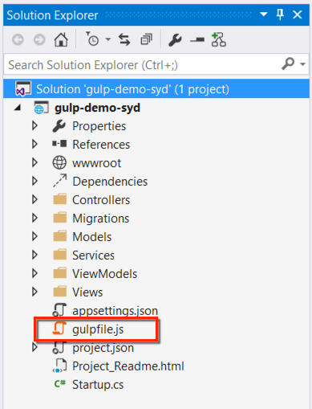
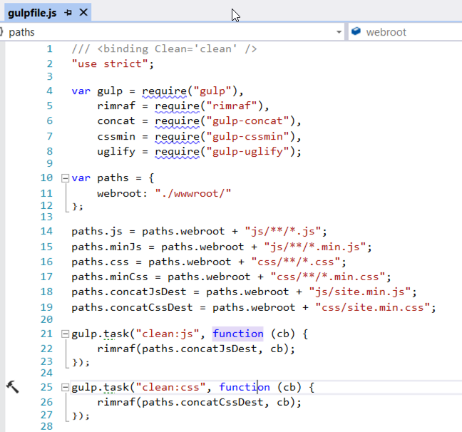
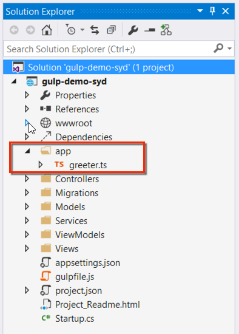

<properties
   pageTitle="Getting Started with Gulp"
   description="Introduction to extending the default front end build process with Gulp"
   services="service-name"
   documentationCenter="dev-center-name"
   authors="adamstephensen"
   manager="adamstephensen"
   editor=""/>


# Getting started with Gulp

In this demonstration we will

- Create a class ASP.Net 5 Project
- Inspect the existing Gulp task
- Add some TypeScript
- Compile the TypeScript to the wwwroot folder


## Create an ASP.Net 5 Project


## Inspect the existing Gulp task

  
Figure: Open the gulp file that comes by default in the solution


  
Figure: Inspect the default actions

## Add some TypeScript


1. Create a new folder from the root of the application /app
2. Create a new file in the /app folder called greeter.ts

  
Figure: Create a new file in the /app folder called greeter.ts


2. Add the following TypeScript to greeter.ts

```
      class Greeter {
            constructor(public greeting: string) { }
            greet() {
               return "<h1>" + this.greeting + "</h1>";
          }
      };
      
      var greeter = new Greeter("Hello, world!");
          
      document.body.innerHTML = greeter.greet();
```

## Create the gulp task

1. Go to solution explorer and choose 'show all files'
2. Open package.json and a2d 'gulp-typescript'


## Compile the TypeScript to the wwwroot folder

Add the following gulp task

```
gulp.task("compile-ts", function () {

    return gulp.src(paths.appTs)
        .pipe(tsc({
            target: "ES5",
            declarationFiles: false,
            noExternalResolve: true,
            module: "commonjs"
        }))
    .pipe(gulp.dest(paths.appOutput))
    ;
```
