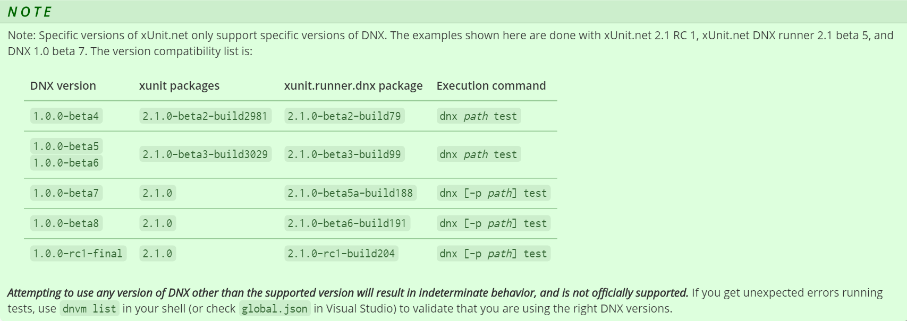
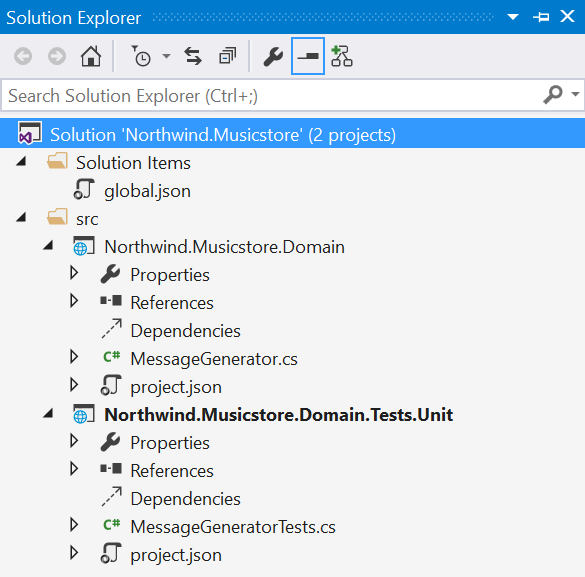
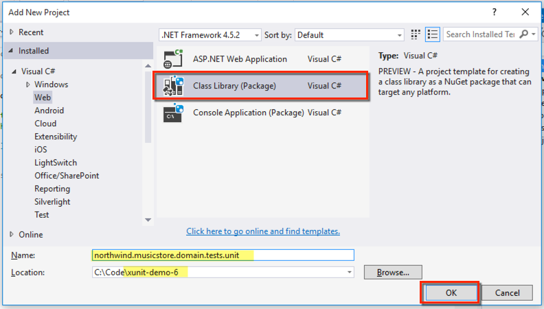
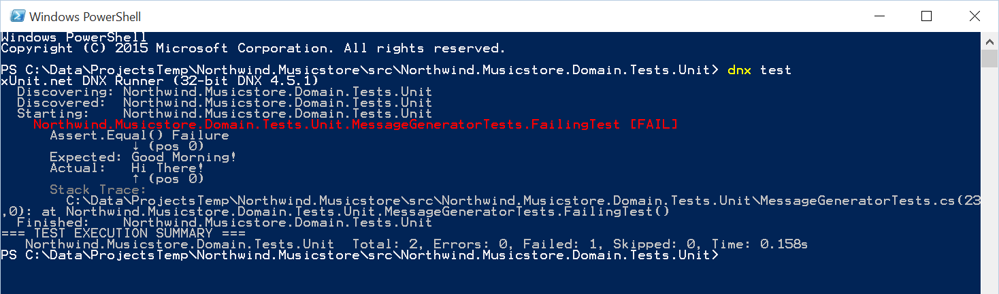
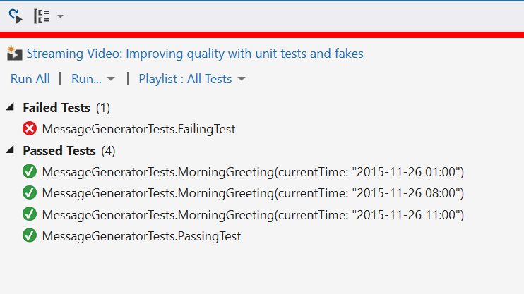

<properties
   pageTitle="Getting Started with XUnit"
   description="Introduction to writing simple tests with XUnit"
   services="service-name"
   documentationCenter="dev-center-name"
   authors="adamstephensen"
   manager="adamstephensen"
   editor=""/>

# Getting started with XUnit

In this demonstration we will 

- Create a class library project
- Create a test project
- Write some simple tests
- Run tests from the command line
- Run tests from inside Visual Studio

## Version Compatibility

Note: Specific versions of xUnit.net only support specific versions of DNX. The examples shown here are done with xUnit.net 2.1 RC 1, xUnit.net DNX runner 2.1 beta 5, and DNX 1.0 beta 7. The version compatibility list is:

  
Figure: See http://xunit.github.io/docs/getting-started-dnx.html for up to date information.

If you haven't updated to ASP.NET 5 RC1 yet, follow the steps here:  
https://docs.asp.net/en/latest/getting-started/installing-on-windows.html

## Create two class library projects

  
Figure: Your solution should now resemble the above

## Create a test project

  
Figure: Add a project for northwind.musicstore.tests.unit

## Update project.json
ASP.NET 5 RC1 has brought with it a new set of frameworks (careful: even different from the betas!) called `net451` and `dotnet5.4`.
XUnit is not yet compatible with these newer frameworks, so be sure to target the backwards compatible `dnx451` and `dnxcore50` until further notice.

Change your **test project's** project.json file as per the below example:  
 - Add the `dependencies` property
 - Add the `commands` property
 - Change `net451` to `dnx451`
 - Change `dotnet5.4` to `dnxcore50`

Your `project.json` file inside the test project should look similar to this:

    {
      "version": "1.0.0-*",
      "description": "Northwind.Musicstore.Domain.Tests.Unit Class Library",
      "authors": [ "Ben" ],
      "tags": [ "" ],
      "projectUrl": "",
      "licenseUrl": "",
      "dependencies": {
        "xunit": "2.1.0",
        "xunit.runner.dnx": "2.1.0-rc1-build204"
      },
      "commands": {
        "test": "xunit.runner.dnx"
      },
      "frameworks": {
        "dnx451": { },
        "dnxcore50": {
          "dependencies": {
            "Microsoft.CSharp": "4.0.1-beta-23516",
            "System.Collections": "4.0.11-beta-23516",
            "System.Linq": "4.0.1-beta-23516",
            "System.Runtime": "4.0.21-beta-23516",
            "System.Threading": "4.0.11-beta-23516"
          }
        }
      }
    }

Change your **domain project's** project.json file as per the below:  
 - Add `dnx451` to the list of `frameworks`

This will ensure that a compatible assembly is produced for our test project to reference. 
 
## Add the message generator domain class

Add the code below to provide a method that can calculate a greeting

    namespace Northwind.Musicstore.Domain
    {
        public class MessageGenerator
        {
            public string Greet(DateTime currentTime)
            {
                if (currentTime.Hour < 12)
                {
                    return "Good Morning!";
                }
                else
                {
                    return "Hi There!";
                }
            }
        }
    }

## Write some simple tests

Add a reference to the Domain project from your Test project so we can create an instance of the MessageGenerator.

Add your first unit tests to the `MessageGeneratorTests.cs` file as below:

    namespace Northwind.Musicstore.Domain.Tests.Unit
    {
        public class MessageGeneratorTests
        {
            [Fact]
            public void PassingTest()
            {
                var messageGenerator = new MessageGenerator();
                Assert.Equal("Good Morning!", messageGenerator.Greet(new DateTime(2015, 11, 26)));
            }
    
            [Fact]
            public void FailingTest()
            {
                var messageGenerator = new MessageGenerator();
                Assert.Equal("Good Morning!", messageGenerator.Greet(new DateTime(2015, 11, 26, 23, 00, 00)));
            }
        }
    }

## Run tests from the command line

Open a powershell window from within your test project's folder and run: `dnx test`

  
Figure: One test passes and the other fails. Hooray!

## Write some simple theories

A theory lets you test a single test multiple times with different inputs. This is especially handy for showing which cases you expect to succeed.

Add the following theory to your tests class.

    [Theory]
    [InlineData("2015-11-26 01:00")]
    [InlineData("2015-11-26 08:00")]
    [InlineData("2015-11-26 11:00")]
    public void MorningGreeting(string currentTime)
    {
        var messageGenerator = new MessageGenerator();
        Assert.Equal("Good Morning!", messageGenerator.Greet(DateTime.Parse(currentTime)));
    }

## Run tests from inside Visual Studio

Running tests inside visual studio is easy! 

Go to **Test > Windows > Test Explorer**

Click Run All at the top and watch them go. You should also note that each value for a theory counts as a separate test, making debugging a breeze!

